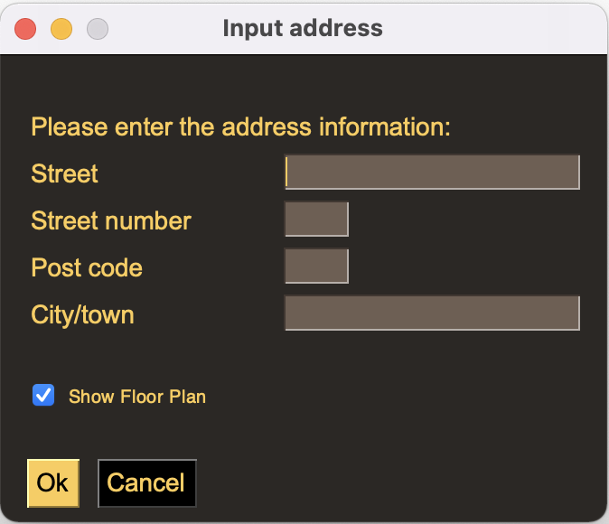
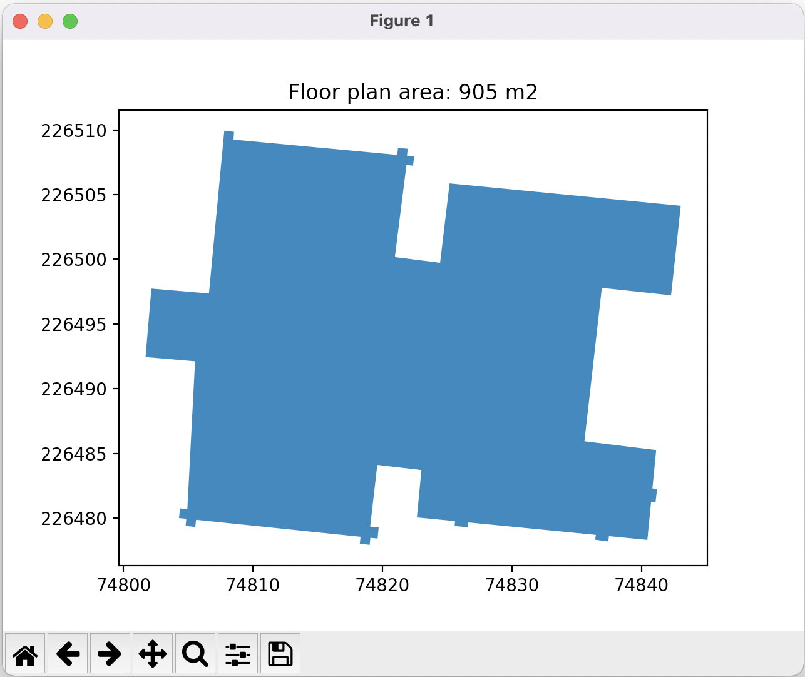
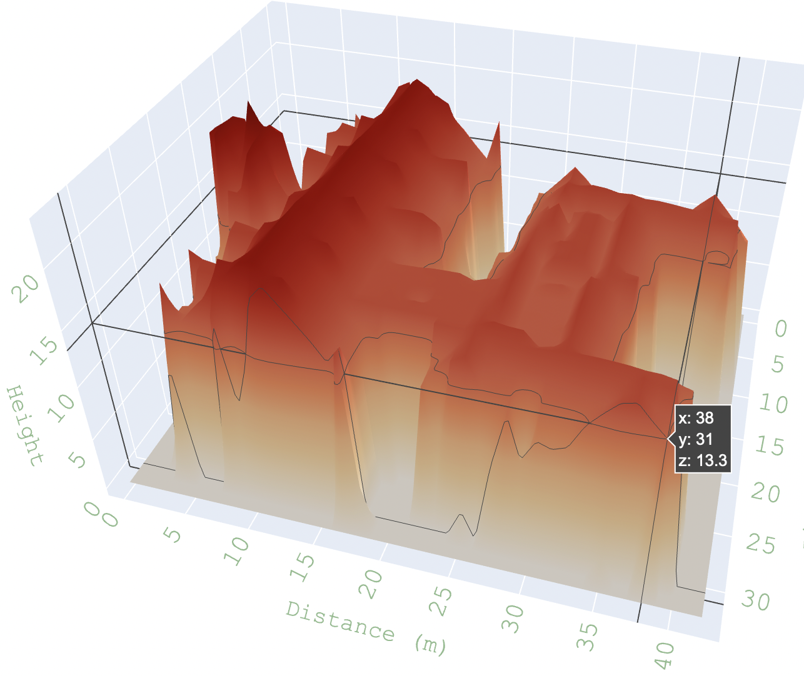

# 3D_House

# Description

This program shows 3D model of the house of any given address in Flanders. 

Challenge:
* Solo project: Jari Erämaa
* Must-have: 3D lookup of houses
* Showing the house based on address
* Lidar files were provided

As an input an address is needed. Based to that address the solution selects correct lidar (light detection and ranging) files (surface and terrestial).

# Installation

## Required modules and versions
There are modules that are needed to run this program. Here is a list of them and version that are tested with this program. Python version used is 3.9.10.

| Module        | Version  |
|---------------| ---------|
| geopandas     | 0.9.0    |
| matplotlib.   | 3.5.0    |
| natsort       | 7.1.1	    |
| numpy         | 1.21.2.  |
| pandas        | 1.3.5	   |
| plotly        | 5.6.0    |
| PySimpleGUI   | 4.57.0   |
| python        | 3.9.10   |
| rasterio      | 1.1.0	   |
| requests      | 2.27.1  |
| shapefile     | 2.1.3	   |
| shapely       | 1.7.1   |

## File handling
File locations are defined in a JSON file: './data/dsm\_and\_dtm\_directories'. 
There are four file locations:

| Operation                  | Command                                  |
|----------------------------| -----------------------------------------|
| dsm_source            | path for original dsm files                    |
| dsm_path            | contains only the required dsm .tif and .shp files (copied with setup.py program)            |
| dtm_source            | path for original dtm files                      |
| dtm_path            | contains only the required dtm .tif and .shp files (copied with setup.py program)                    |

Please, edit this JSON file before running setup.py.

setup.py copies the files to correct location and creates lambert_coordinates.csv file. Lambert csv file is needed to optimize the code (only required .tif file is opened). Before using setup.py remember to edit the JSON file that contains the folder locations.

| Operation                  | Command                                  |
|----------------------------| -----------------------------------------|
| Copy DSM files             | python setup.py dsm                      |
| Copy DTM files             | python setup.py dtm                      |
| Create lambert coordinates | python setup.py lambert                  |
| all above at once*         | python setup.py dsm dtm lambert          |

*as shown above it's possible to combine commands. However, note that files needs to be copied before creating lambert csv-file!

# Usage

The program can be started wit command: 'python main.py'. The following user interface will open:

*User interface for addresss*

You can enter any address in Flanders and it will be shown after pressing 'Ok'-button. It's not required to fill in both town name and post code, either of them is enough. If address is not found, a error message will open. Also if there is any errors in the address, for example the post code is not four digits. 

If 'Show floor plan' is selected then the Floor plan will be shown before showing the actual 3D House model. In this case the 3D model will be shown as soon as the floor plan is closed.

*Example picture of the Floor plan*

The Floor plan contains all the coordinates and there is also calculated area in square meters.

The actual 3D model will open to web browser as soon as Floor plan picture is closed or directly after pressing Ok-button, if 'Show floor plan' -check box is not selected.

*3D house model*

The 3D model is standard plotply graph. It's easy to see all the measurements of the building. You are able to rotate the house with mouse, pan or zoom in/out. Furthermore, there is alsoa 'Rotate' button in the 3D model. By pressing this button the 3D model will rotate 360 degrees. 

#  Speed is everything

During this project a lot of optimization and time measurement has been done in order to make the program efficient. Currently the weakest link is the API. It will take somewhere between one to five seconds collect the data via API interface. Other than that it takes less than second to do the rest of calculation. Time is calculated from pressing Address UI Ok-button until the 3D model has been fully opened. 

There was a plan to create a cache to store the information from those houses that have already been searched. By that way it would be possible to avoid using API if the address has been opened earlier and the respons time for the progam would be less than second.

